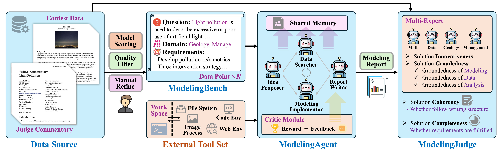

# ModelingAgent: Bridging LLMs and Mathematical Modeling for Real-World Challenges
[**📊 Dataset**](https://github.com/qiancheng0/ModelingAgent/tree/main/data) | [**📖 Paper**](https://www.arxiv.org/pdf/2505.15068)

This repository contains the official code and dataset for the paper *"ModelingAgent: Bridging LLMs and Mathematical Modeling for Real-World Challenges."*

The data includes the ModelingBench dataset, featuring detailed question descriptions, requirements, and evaluation criteria.



## 🔍 Quick Start
First, install the required packages by running:
```bash
pip install -r requirements.txt
```

### Model and API Setup
Some models may require API keys to function correctly. Please add the appropriate keys to the configuration file located in each directory under `src`.

We use the Serper API as the backend to support our Search tool. Please include your Serper API key to use this feature ([**link**](https://serper.dev)).

```json
{
    "openai_key": "YOUR_OPENAI_API_KEY",
    "google_api_key": "YOUR_GOOGLE_API_KEY",
    "serper_key": "YOUR_SERPER_API_KEY"
}
```

If you are testing a self-hosted model, please use the script in the `src/host` directory. We currently support hosting models (and their tool-use functions) through `vllm`. The supported open-source model hosting scripts include: `Llama-3.1-70B-Instruct`, `Qwen-2.5-72B-Instruct`, and `QwQ-32B`.

### ModelingBench Data
Our ModelingBench data is located in the `data` directory. It can be freely used for various purposes. Each data point contains several fields. Here is an example:
```json
"2001_Adolescent_Pregnancy": {
    "year": "2001",
    "title": "Adolescent Pregnancy",
    "level": "High School",
    "source": "HiMCM",
    "link": "Problems/2001/HIMCM-A-2/index.html",
    "question": "You are working temporarily for the Department of Health ...",
    "requirements": [
        {
            "category": "Data Analysis", 
            "description": "Evaluate the accuracy and completeness of the data ..."
        }
    ],
    "eval_roles": [
        {
            "name": "Mathematician",
            "details": "You are a mathematician with expertise in ..."
        }
    ]
}
```

## 🧪 Experiments

### Testing Code
We provide testing code for Vanilla Generation in the `ModelBase` directory, Tool Agent in `ModelTool`, and ModelingAgent in `ModelAgent`. Please ensure the model configuration files are correctly set up with the required API keys and configurations.

Also, set the output directory and other paths properly in the respective entry point file you wish to run. You can then run the following:
```bash
cd ModelBase # For running Vanilla Generation
python baseline.py

cd ModelTool # For running Tool Agent
python baseline.py

cd ModelAgent # For running ModelingAgent
python mathmodel.py
```

Please note that some errors may still exist due to the complexity of the agent structure. The model may not always use tools optimally or strictly follow instructions. Use this preview version with caution.

### Evaluation
We use the ModelingJudge framework to evaluate the final generated reports. The expert roles for each problem are included in the ModelingBench dataset.

To evaluate using ModelingJudge, run:
```bash
cd src/judger
python main_judge.py
```

Each evaluation metric corresponds to a Python file containing its specific prompt.

## 📖 File Structure
- Benchmark data is located in the `data` directory.
- Under `src/`, we include the code for our method and two baselines in `ModelAgent`, `ModelBase`, and `ModelTool`.
- The `judger` directory contains code, evaluation standards, and prompts for ModelingJudge.
- The `tools` directory contains all tools that may be invoked in the sandbox environment.

## 🖊️ Citation
```text
@article{qian2025modelingagent,
  title={ModelingAgent: Bridging LLMs and Mathematical Modeling for Real-World Challenges},
  author={Qian, Cheng and Du, Hongyi and Wang, Hongru and Chen, Xiusi and Zhang, Yuji and Sil, Avirup and Zhai, Chengxiang and McKeown, Kathleen and Ji, Heng},
  journal={arXiv preprint arXiv:2505.15068},
  year={2025}
}
```
